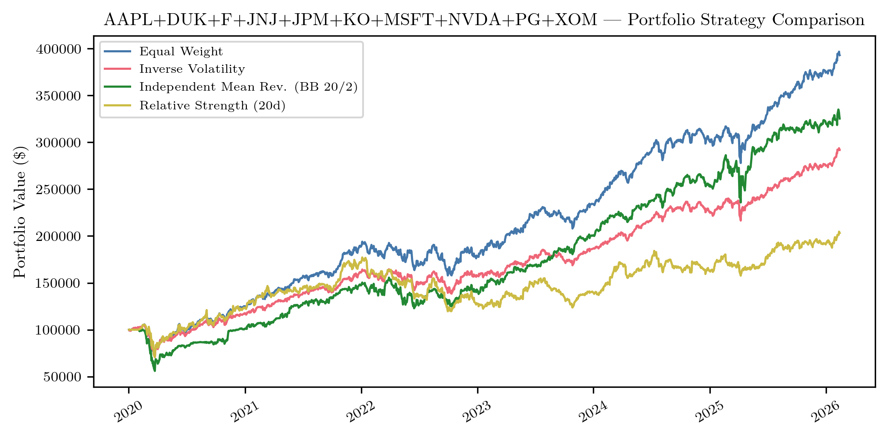

# Finance Tools

A modular research platform for prototyping, backtesting, and live-testing equity trading strategies. Designed as an extensible sandbox where new models -- from simple moving-average crossovers to stochastic mean-reversion processes -- can be implemented against a common backtesting interface, validated with Monte Carlo stress tests, and promoted to paper trading with a single flag change.

The library separates concerns cleanly: strategy logic knows nothing about execution, broker adapters know nothing about signals, and the backtesting engine treats both as pluggable components. Adding a new strategy means implementing one method (`decide`); adding a new broker means implementing five. Everything else -- position tracking, cash reserves, DRIP, risk limits, performance attribution -- is handled by the framework.

Development is accelerated with [Claude Code](https://docs.anthropic.com/en/docs/claude-code), Anthropic's agentic coding tool. The full codebase -- 611 tests, 11K+ lines of library code, five application frontends -- was built iteratively through human-AI collaboration, with Claude handling implementation, test generation, and refactoring while the author directed architecture and strategy design.

## Features

- **Backtesting engine** -- single-stock and multi-stock portfolio backtesting with pluggable strategy interface
- **Portfolio strategies** -- Equal Weight, Inverse Volatility, Mean Reversion (Bollinger Bands), Relative Strength, Regime-Adaptive (VIX/trend classification)
- **Intraday strategies** -- Chebyshev inequality z-score and Ornstein-Uhlenbeck mean-reversion, with configurable risk limits
- **Monte Carlo stress testing** -- random time-window sampling across strategies to assess robustness
- **Live paper trading** -- interactive CLI with local simulation or Alpaca API execution, WebSocket streaming support
- **Performance analytics** -- Sharpe ratio (dynamic T-bill risk-free rate), max drawdown, per-ticker P&L attribution, rolling regime classification
- **Streamlit dashboard** -- interactive backtest comparison with stored results (SQLite)
- **Publication-quality plots** -- SciencePlots + LaTeX rendering, colorblind-safe Tol Bright palette, 300 DPI

## Example: Strategy Comparison

10-stock portfolio ($100K, 2020--2026) comparing four strategies across 1,538 trading days:



| Strategy | Final Value | Ann. Return | Sharpe | Max Drawdown | Trades |
|---|---|---|---|---|---|
| Equal Weight | $393,065 | 25.1% | 1.13 | -32.8% | 80 |
| Inverse Volatility | $291,940 | 19.2% | 0.95 | -32.7% | 148 |
| Mean Reversion (BB 20/2) | $325,416 | 21.3% | 0.87 | -44.4% | 1,463 |
| Relative Strength (20d) | $203,316 | 12.3% | 0.51 | -33.0% | 8,559 |

*Tickers: AAPL, DUK, F, JNJ, JPM, KO, MSFT, NVDA, PG, XOM. Risk-free rate: avg 2.75% (3-mo T-bill). Dividends reinvested.*

Equal Weight dominates on risk-adjusted return -- a result that holds across universe sizes (10 to 50 stocks) and time horizons (5 to 10 years) in our tests. Regime-adaptive switching (VIX-based delegation to EW/MR/RS) underperforms static EW for diversified portfolios, consistent with the well-known difficulty of market timing.

## Architecture

```
FinanceTools/
├── finance_tools/           # pip-installable library
│   ├── backtest/            # Engines: single-stock, portfolio, Monte Carlo, intraday
│   ├── broker/              # Broker adapters: Alpaca REST/WebSocket, yfinance feeds
│   ├── strategies/          # Strategies: EW, inv-vol, Bollinger, momentum, OU, Chebyshev
│   ├── data/                # 50-stock S&P 500 universe, market data, SQLite results store
│   └── utils/               # Plotting (SciencePlots, KDE contours, Tol Bright palette)
├── apps/
│   ├── portfolio_trader/    # Interactive CLI -- local JSON or Alpaca paper trading
│   ├── intraday_trader/     # Intraday CLI + Streamlit -- polling or WebSocket streaming
│   ├── backtester/          # Backtest runners: strategy comparison, regime analysis, stress test
│   └── dashboard/           # Streamlit dashboard for stored backtest results
└── tests/                   # 611 pytest tests
```

### Extending

**New strategy (portfolio):** subclass `PortfolioStrategy`, implement `decide(day, hist_dict, state) -> dict[str, Action]`. Register in a runner script. The engine handles position tracking, cash reserves, and DRIP.

**New strategy (intraday):** subclass `Strategy`, implement `decide(day, history, portfolio) -> Action`. Wire into the app with a `--strategy` flag. Risk limits (circuit breaker, max position, cash reserve) are enforced by the framework.

**New broker:** implement `get_positions`, `get_cash`, `get_prices`, `execute_buy`, `execute_sell`. Both the portfolio trader and intraday trader will route through it.

## Quick Start

```bash
# Install (editable, with all optional deps)
pip install -e ".[all]"

# Run tests
python -m pytest tests/ -v

# Run a portfolio backtest
python apps/backtester/run.py --tickers MSFT AAPL F JNJ --cash 10000

# Launch the portfolio trader (local broker)
python apps/portfolio_trader/app.py --broker local --cash 5000

# Launch the portfolio trader (Alpaca paper trading)
python apps/portfolio_trader/app.py --broker alpaca --profile portfolio

# Launch the intraday trader (OU mean-reversion)
python apps/intraday_trader/app.py MSFT --strategy ou --broker local

# Launch the Streamlit dashboard
streamlit run apps/dashboard/app.py
```

## Broker Modes

The portfolio and intraday traders support two broker backends:

| Feature | Local | Alpaca |
|---|---|---|
| State storage | JSON file | Alpaca API (source of truth) |
| Trade execution | Simulated | Real paper orders |
| Dividends | Auto-detected via yfinance | N/A |
| Undo | Batch undo by timestamp | N/A |
| Sharpe tracking | Full replay from transactions | N/A |
| Deposit | Adds to local cash | Shows dashboard link |

## Dependencies

**Required:** numpy, scipy, matplotlib, scienceplots, pandas, yfinance

**Optional:**
- `[alpaca]` -- alpaca-py, pyyaml (for Alpaca paper trading)
- `[streamlit]` -- streamlit, plotly (for dashboards)
- `[dev]` -- pytest

## Tech Stack

Python, pandas, NumPy, SciPy, matplotlib, SciencePlots, yfinance, Alpaca API, Streamlit, SQLite

## License

MIT
